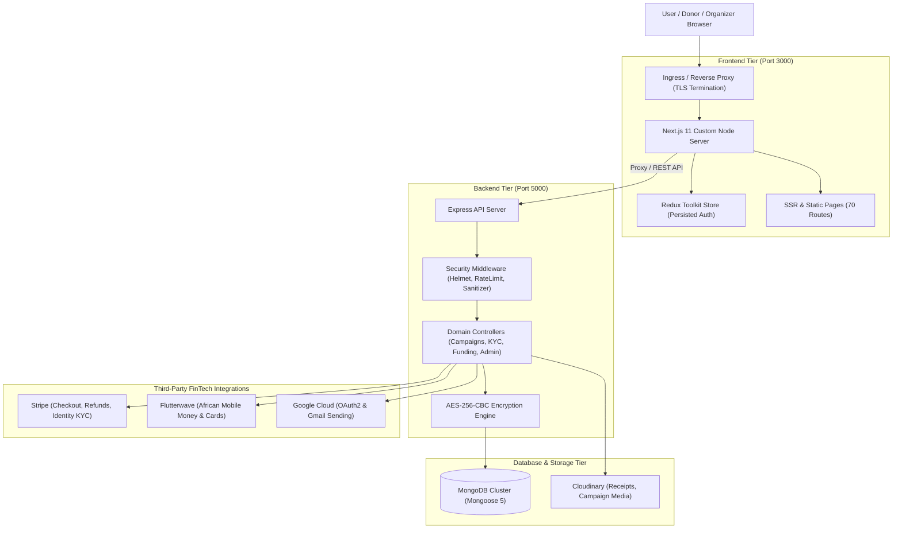
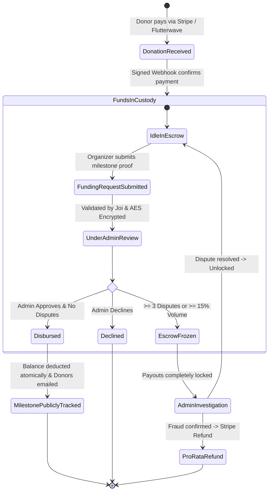
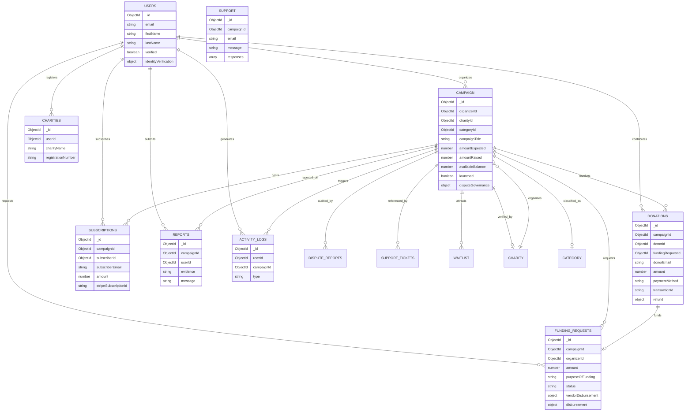

# Fund&Trace — System Architecture & Escrow Engine

This document provides the high-level technical architecture, security perimeter, data flows, and state machine governing the Fund&Trace platform.

---

## 🏗️ High-Level System Architecture



---

## 🔒 The Milestone Escrow State Machine

Fund&Trace does not allow organizers to withdraw donated funds immediately. All funds follow a strict milestone lifecycle:



---

## 🛡️ Security & Anti-Fraud Boundary

```
+-------------------------------------------------------------------------------+
|                             CLIENT PERIMETER                                  |
|  - React Controlled Inputs         - Viewport Safe Area (iOS/Android)         |
|  - Strict TypeScript Validation   - Localhost Port Guard (prevents collisions)|
+-------------------------------------------------------------------------------+
                                      │
                                      ▼
+-------------------------------------------------------------------------------+
|                            NETWORK & TRANSPORT                                |
|  - HSTS (max-age=31536000)         - Strict CORS Whitelist (credentials: true)|
|  - NoSQL Payload Sanitization      - Multi-Tier IP Rate Limiting (50/300 req) |
+-------------------------------------------------------------------------------+
                                      │
                                      ▼
+-------------------------------------------------------------------------------+
|                           DATA & CRYPTO LAYER                                 |
|  - Bank details encrypted at rest using AES-256-CBC + Initialization Vector   |
|  - Fail-fast database configuration (bufferCommands: false, 2000ms timeout)   |
|  - Environment assertion at startup (assertValidConfig fails on weak secrets) |
+-------------------------------------------------------------------------------+
```

---

## 📊 Core Data Entity Relationships


