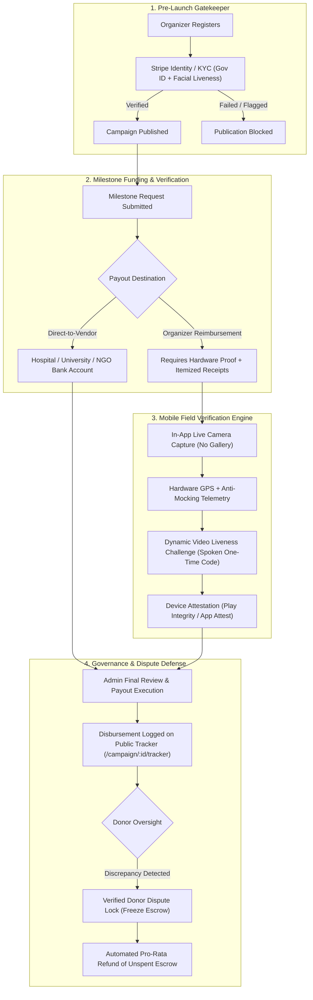

# Fund&Trace: Advanced Anti-Fraud, KYC & Mobile Proof-of-Implementation Execution Plan

---

## Executive Summary

This specification outlines the technical blueprint, architectural designs, data models, API contracts, and implementation milestones to eliminate crowdfunding fraud on **Fund&Trace**. 

By combining **Stripe Identity (KYC/Biometrics)**, **Automated Direct-to-Vendor Disbursements**, **Donor-Governed Escrow Freezing**, and **Hardware-Backed Mobile Field Verification (GPS & Live Video Challenge)**, Fund&Trace transitions from traditional honor-based crowdfunding to a cryptographic, milestone-verified escrow protocol.

---



---

## Pillar 1: Stripe Identity & Biometric KYC Integration

### 1.1 Objective
Ensure that **100% of campaign creators and beneficiaries undergo mandatory Know Your Customer (KYC)**, government ID extraction, and facial liveness verification prior to publishing any campaign.

### 1.2 Data Schema Enhancements
In `FundandTraceBackend/models/users.js` and `campaignModel.js`:

```javascript
identityVerification: {
  status: {
    type: String,
    enum: ["unverified", "pending", "verified", "requires_input", "canceled"],
    default: "unverified",
    index: true,
  },
  sessionId: { type: String, default: null },
  verifiedAt: { type: Date, default: null },
  idDocument: {
    type: { type: String, default: null }, // "passport", "driving_license", "id_card"
    country: { type: String, default: null },
    expirationDate: { type: String, default: null },
  },
  redactedName: { type: String, default: null },
  facialLivenessMatched: { type: Boolean, default: false },
}
```

### 1.3 Backend API Endpoints

| Method | Endpoint | Description |
| :--- | :--- | :--- |
| `POST` | `/api/identity/create-session` | Generates a Stripe Identity Verification Session URL and modal client secret. |
| `GET` | `/api/identity/status` | Returns the active KYC verification status of the authenticated user. |
| `POST` | `/api/identity/webhook` | Listens to `identity.verification_session.verified` and `requires_input` events. |

### 1.4 Frontend Publishing Gate
In `FundandTrace/src/pages/StartACampaign/Prelaunch.tsx`:
* Check `user.identityVerification.status === "verified"`.
* If unverified, render a dedicated **"Verify Your Identity"** modal powered by `@stripe/stripe-js` Identity SDK before the "Launch Campaign" button unlocks.

---

## Pillar 2: Automated Direct-to-Vendor Payout Routing

### 2.1 Objective
Eliminate personal checking account misappropriation by enabling payouts to be transferred directly to accredited institutions (e.g., Hospital Billing Dept, University Bursar, Registered NGO, Licensed Contractor).

### 2.2 Data Schema Enhancements
In `FundandTraceBackend/models/fundingRequestModel.js`:

```javascript
vendorDisbursement: {
  isDirectToVendor: { type: Boolean, default: false },
  vendorCategory: {
    type: String,
    enum: ["Hospital / Healthcare Provider", "Educational Institution", "Accredited NGO", "Licensed Contractor", "Supplier", "Other"],
  },
  vendorLegalName: { type: String, default: "" },
  vendorTaxIdOrRegistration: { type: String, default: "" },
  vendorContactEmail: { type: String, default: "" },
  vendorContactPhone: { type: String, default: "" },
  bankDetails: {
    routingOrSortCode: { type: String, default: "" },
    accountNumber: { type: String, default: "" },
    accountName: { type: String, default: "" },
    bankName: { type: String, default: "" },
    swiftOrIban: { type: String, default: "" },
  },
  invoiceDocumentUrl: { type: String, default: "" },
  invoiceNumber: { type: String, default: "" },
  invoiceTotalAmount: { type: Number, default: 0 },
}
```

### 2.3 UI & Controller Workflow
1. In `src/pages/dashboard/[id]/fundingRequest.tsx`, add a switch: **"Payout Destination: Direct to Verified Vendor"**.
2. When toggled, the form prompts for Vendor Institution Name, Tax/Registration ID, Official Invoice Number, and IBAN/Routing details.
3. Automated validation checks that `invoiceTotalAmount === requestedFundingAmount`.
4. Payout execution utilizes Stripe Custom Connect Accounts or Flutterwave Transfer to vendor bank endpoints directly.

---

## Pillar 3: Escrow Dispute Lock & Donor Consensus Engine

### 3.1 Objective
Empower verified donors to act as an active governance layer. If evidence is fake or a milestone is violated, donors can trigger an instant freeze on all unreleased escrow tranches.

### 3.2 Data Schema Enhancements
In `FundandTraceBackend/models/campaignModel.js`:

```javascript
disputeGovernance: {
  isLocked: { type: Boolean, default: false, index: true },
  lockedAt: { type: Date, default: null },
  lockReason: { type: String, default: "" },
  disputeReports: [
    {
      donorId: { type: mongoose.Schema.Types.ObjectId, ref: "users" },
      donorEmail: String,
      donationId: { type: mongoose.Schema.Types.ObjectId, ref: "donations" },
      disputeCategory: {
        type: String,
        enum: ["Fake Evidence / Altered Receipt", "Misappropriation of Funds", "Inactive / Abandoned Milestone", "Identity Mismatch", "Other"],
      },
      description: String,
      evidenceAttachmentUrl: String,
      createdAt: { type: Date, default: Date.now },
    }
  ],
  totalDisputeVolumeUSD: { type: Number, default: 0 },
}
```

### 3.3 Automated Circuit Breaker Logic
* **Freeze Trigger Rules**:
  1. If $\ge 3$ distinct verified donors file a dispute report on a single milestone, OR
  2. If donors representing $\ge 15\%$ of the total raised volume file dispute reports.
* **Automated Actions Upon Trigger**:
  * Set `campaign.disputeGovernance.isLocked = true`.
  * Transition all pending funding requests to `status: "Frozen - Under Review"`.
  * Trigger priority webhook alert to Compliance Admin dashboard.
  * Allow platform admins to either **Dismiss Malicious Dispute** or **Execute Pro-Rata Escrow Clawback Refund** via `FundandTraceBackend/controller/admin/refunds.js`.

### 3.4 Public Tracker UI
In `src/pages/campaign/[id]/tracker.tsx`:
* Add a **"Report Milestone Discrepancy"** button visible on each milestone card.
* Only enabled for authenticated donors who have an active `donationId` attached to the campaign.

---

## Pillar 4: Mobile Hardware Field Verification (GPS, Live Camera & Video Challenge)

### 4.1 Objective
Eliminate phantom construction projects and stock-photo scams by capturing hardware-signed, tamper-evident physical proof on mobile devices.

### 4.2 Telemetry & Verification Schema
In `FundandTraceBackend/models/fundingRequestModel.js`:

```javascript
mobileFieldVerification: {
  captureTimestampNTP: { type: Date, default: null },
  geolocation: {
    latitude: { type: Number, default: null },
    longitude: { type: Number, default: null },
    altitude: { type: Number, default: null },
    accuracyMeters: { type: Number, default: null },
    isMockProvider: { type: Boolean, default: false },
    distanceFromProjectMeters: { type: Number, default: null },
  },
  deviceAttestation: {
    platform: { type: String, enum: ["ios", "android", "mobile_web"] },
    attestationToken: { type: String, default: null },
    hardwareKeystoreSigned: { type: Boolean, default: false },
    isRootedOrJailbroken: { type: Boolean, default: false },
  },
  livenessChallenge: {
    challengeCode: { type: String, default: "" }, // e.g. "FT-8492"
    spokenCodeVerified: { type: Boolean, default: false },
    videoPlaybackUrl: { type: String, default: "" },
    durationSeconds: { type: Number, default: 0 },
  }
}
```

### 4.3 Technical Implementation Specifications

#### A. Web Mobile Layer (Immediate HTML5 Standard)
* Enforce native hardware camera triggering:
  ```html
  <input type="file" accept="image/*,video/*" capture="environment" id="liveCapture" />
  ```
* Capture high-accuracy GPS telemetry simultaneously:
  ```typescript
  navigator.geolocation.getCurrentPosition(
    (position) => {
      const { latitude, longitude, altitude, accuracy } = position.coords;
      // Send coordinates to backend geofence verification
    },
    (err) => console.error(err),
    { enableHighAccuracy: true, timeout: 10000, maximumAge: 0 }
  );
  ```

#### B. Native Mobile Verifier Layer (React Native / Flutter Architecture)
* **Live Camera Stream**: Uses `react-native-vision-camera` to capture directly to memory buffer; gallery file pickers are omitted.
* **Anti-Mock GPS Engine**:
  * Android: Check `Location.isFromMockProvider()` and test for mock location developer settings.
  * iOS: Validate `CLLocation.isSimulatedBySoftware`.
* **Hardware Attestation**:
  * Android: Passes safety attestation payload to Google Play Integrity API.
  * iOS: Signs verification payload using Apple `DeviceCheck` / `AppAttest` private hardware enclave keys.
* **Dynamic Liveness Challenge**:
  * The backend generates a random 6-character phonetic challenge (e.g. `ALPHA-9-TANGO`).
  * The organizer records a 5-to-10 second video stating the code while showing the physical project site.

---

## Execution Roadmap & Milestone Matrix

```
┌─────────────────────────────────────────────────────────────────────────────────────────┐
│ MILESTONE 1: KYC Gatekeeper (Days 1–3)                                                  │
│ • Stripe Identity SDK Integration & Backend Webhooks                                    │
│ • Campaign Prelaunch publishing guard in StartACampaign/Prelaunch.tsx                   │
├─────────────────────────────────────────────────────────────────────────────────────────┤
│ MILESTONE 2: Direct-to-Vendor Routing & Schema (Days 4–6)                                │
│ • Update fundingRequestModel.js with vendorDisbursement fields                          │
│ • Build Direct-to-Vendor UI switch in dashboard/[id]/fundingRequest.tsx                  │
├─────────────────────────────────────────────────────────────────────────────────────────┤
│ MILESTONE 3: Donor Escrow Dispute Lock & Circuit Breaker (Days 7–9)                     │
│ • Build Dispute modal on /campaign/[id]/tracker.tsx                                     │
│ • Implement auto-freeze threshold & Admin Review resolution actions                     │
├─────────────────────────────────────────────────────────────────────────────────────────┤
│ MILESTONE 4: Mobile Verification Engine & HTML5 Live Capture (Days 10–14)               │
│ • Update proof upload with HTML5 capture="environment" + GPS telemetry extraction      │
│ • Implement Geofence boundary check & Admin Satellite Map verification                 │
└─────────────────────────────────────────────────────────────────────────────────────────┘
```

---

## Compliance, Privacy & Security Standards

1. **HIPAA & Medical Privacy**:
   * Patient names, specific diagnostic codes, and facial features are blurred on-device prior to public tracker upload.
   * Only direct billing receipts to certified healthcare providers are required for disbursement.
2. **GDPR / CCPA Data Minimization**:
   * Raw biometric photos are retained exclusively within Stripe Identity's SOC2/PCI-compliant enclave; only the boolean `facialLivenessMatched` and document expiration date are stored in Fund&Trace databases.
3. **Escrow Safety**:
   * All unreleased campaign funding remains held in multi-sig custodial accounts, fully segregated from platform operational funds.
