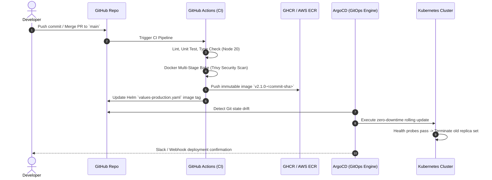

# Fund&Trace: Production Kubernetes (k8s), Helm & Cloud Infrastructure Blueprint

---

## 1. Executive Overview & Target Architecture

This blueprint provides the standard architecture for deploying, scaling, and managing **Fund&Trace** on Kubernetes. It transitions the application from single-node Docker containers to an enterprise-ready, multi-zone, auto-scaling cloud infrastructure with automated GitOps CI/CD.

```mermaid
flowchart TD
    subgraph Traffic ["Edge & Ingress Layer"]
        DNS["Route53 / Cloudflare DNS"] --> WAF["Cloudflare WAF / DDoS Guard"]
        WAF --> LB["Cloud Load Balancer (NLB / ALB / DO LB)"]
        LB --> Ingress["Ingress-NGINX / Traefik Controller"]
        CertMgr["cert-manager (Let's Encrypt TLS)"] -.-> Ingress
    end

    subgraph K8s ["Kubernetes Cluster (EKS / GKE / DOKS)"]
        subgraph Frontend_PodGroup ["Frontend Service Mesh"]
            Ingress --> SvcFE["fundandtrace-fe-svc (ClusterIP: 3000)"]
            SvcFE --> PodFE1["FE Pod 1 (Next.js Node 20)"]
            SvcFE --> PodFE2["FE Pod 2 (Next.js Node 20)"]
            SvcFE --> PodFEN["FE Pod N (Autoscaled)"]
            HPA_FE["HPA (CPU/Memory/RPS > 70%)"] -.-> Frontend_PodGroup
        end

        subgraph Backend_PodGroup ["Backend API Mesh"]
            Ingress --> SvcBE["fundandtrace-be-svc (ClusterIP: 5000)"]
            SvcBE --> PodBE1["BE Pod 1 (Express API)"]
            SvcBE --> PodBE2["BE Pod 2 (Express API)"]
            SvcBE --> PodBEN["BE Pod N (Autoscaled)"]
            HPA_BE["HPA (CPU/Latency > 65%)"] -.-> Backend_PodGroup
        end

        subgraph Cache_Layer ["In-Memory Acceleration"]
            PodBE1 --> Redis["Redis Cluster / DragonflyDB"]
            PodBE2 --> Redis
        end
    end

    subgraph Persistence ["Persistence & Database Tier"]
        PodBE1 --> MongoCluster[("MongoDB Replica Set / Atlas M10+")]
        PodBE2 --> MongoCluster
        MongoCluster --> S3Backup[("Automated Continuous S3 / B2 Snapshots")]
    end

    subgraph Observability ["Telemetry & Monitoring Stack"]
        Prometheus["Prometheus Operator / Grafana"]
        Loki["Grafana Loki (Log Aggregation)"]
        Tempo["Grafana Tempo / OpenTelemetry"]
        Frontend_PodGroup -.-> Prometheus
        Backend_PodGroup -.-> Prometheus
    end
```

---

## 2. Directory Structure for Infrastructure as Code (IaC)

Organize your infrastructure repository or `infra/` folder as follows:

```
tribef/
├── infra/
│   ├── terraform/                   # Cloud Provider Provisioning (VPC, Node Groups, IAM)
│   │   ├── environments/
│   │   │   ├── staging/
│   │   │   └── production/
│   │   └── modules/
│   │       ├── eks_cluster/
│   │       └── managed_database/
│   ├── k8s/                         # Raw Kubernetes Manifests (Alternative)
│   │   ├── base/
│   │   │   ├── namespace.yaml
│   │   │   ├── frontend-deployment.yaml
│   │   │   ├── backend-deployment.yaml
│   │   │   ├── ingress.yaml
│   │   │   └── hpa.yaml
│   │   └── overlays/
│   │       ├── staging/
│   │       └── production/
│   └── helm/                        # Helm Packaging (Recommended)
│       └── fundandtrace/
│           ├── Chart.yaml
│           ├── values.yaml
│           ├── values-staging.yaml
│           ├── values-production.yaml
│           └── templates/
│               ├── _helpers.tpl
│               ├── deployment-frontend.yaml
│               ├── deployment-backend.yaml
│               ├── service-frontend.yaml
│               ├── service-backend.yaml
│               ├── ingress.yaml
│               ├── hpa-frontend.yaml
│               ├── hpa-backend.yaml
│               ├── configmap.yaml
│               ├── secrets.yaml
│               └── pdb.yaml
└── .github/
    └── workflows/
        ├── ci-pipeline.yml          # Test, Lint, Security Scan, Docker Bake
        └── cd-gitops.yml            # Helm chart version bump & ArgoCD trigger
```

---

## 3. Production Kubernetes Manifests Reference

### 3.1 Backend API Deployment & Health Checks

```yaml
# infra/k8s/base/backend-deployment.yaml
apiVersion: apps/v1
kind: Deployment
metadata:
  name: fundandtrace-backend
  namespace: fundandtrace
  labels:
    app.kubernetes.io/name: fundandtrace-backend
    app.kubernetes.io/part-of: fundandtrace
spec:
  replicas: 3
  revisionHistoryLimit: 5
  strategy:
    type: RollingUpdate
    rollingUpdate:
      maxSurge: 25%
      maxUnavailable: 0
  selector:
    matchLabels:
      app: fundandtrace-backend
  template:
    metadata:
      labels:
        app: fundandtrace-backend
    spec:
      affinity:
        podAntiAffinity:
          preferredDuringSchedulingIgnoredDuringExecution:
            - weight: 100
              podAffinityTerm:
                labelSelector:
                  matchExpressions:
                    - key: app
                      operator: In
                      values:
                        - fundandtrace-backend
                topologyKey: "kubernetes.io/hostname"
      containers:
        - name: backend
          image: ghcr.io/popedaniels/fundandtrace-backend:latest
          imagePullPolicy: IfNotPresent
          ports:
            - containerPort: 5000
              name: http
          envFrom:
            - configMapRef:
                name: backend-config
            - secretRef:
                name: backend-secrets
          resources:
            requests:
              cpu: 250m
              memory: 256Mi
            limits:
              cpu: 1000m
              memory: 1024Mi
          livenessProbe:
            httpGet:
              path: /api/health
              port: 5000
            initialDelaySeconds: 15
            periodSeconds: 10
            timeoutSeconds: 5
            failureThreshold: 3
          readinessProbe:
            httpGet:
              path: /api/health
              port: 5000
            initialDelaySeconds: 5
            periodSeconds: 5
            timeoutSeconds: 3
            failureThreshold: 2
          lifecycle:
            preStop:
              exec:
                command: ["/bin/sh", "-c", "sleep 10"]
```

---

### 3.2 Horizontal Pod Autoscaler (HPA)

```yaml
# infra/k8s/base/hpa.yaml
apiVersion: autoscaling/v2
kind: HorizontalPodAutoscaler
metadata:
  name: fundandtrace-backend-hpa
  namespace: fundandtrace
spec:
  scaleTargetRef:
    apiVersion: apps/v1
    kind: Deployment
    name: fundandtrace-backend
  minReplicas: 3
  maxReplicas: 20
  metrics:
    - type: Resource
      resource:
        name: cpu
        target:
          type: Utilization
          averageUtilization: 65
    - type: Resource
      resource:
        name: memory
        target:
          type: Utilization
          averageUtilization: 75
  behavior:
    scaleUp:
      stabilizationWindowSeconds: 0
      policies:
        - type: Percent
          value: 100
          periodSeconds: 15
    scaleDown:
      stabilizationWindowSeconds: 300
      policies:
        - type: Percent
          value: 10
          periodSeconds: 60
```

---

### 3.3 Production Ingress & TLS Certificate

```yaml
# infra/k8s/base/ingress.yaml
apiVersion: networking.k8s.io/v1
kind: Ingress
metadata:
  name: fundandtrace-ingress
  namespace: fundandtrace
  annotations:
    kubernetes.io/ingress.class: "nginx"
    cert-manager.io/cluster-issuer: "letsencrypt-prod"
    nginx.ingress.kubernetes.io/proxy-body-size: "25m"
    nginx.ingress.kubernetes.io/proxy-read-timeout: "60"
    nginx.ingress.kubernetes.io/proxy-send-timeout: "60"
    nginx.ingress.kubernetes.io/ssl-redirect: "true"
spec:
  tls:
    - hosts:
        - fundandtrace.com
        - www.fundandtrace.com
        - api.fundandtrace.com
      secretName: fundandtrace-tls-secret
  rules:
    - host: fundandtrace.com
      http:
        paths:
          - path: /api
            pathType: Prefix
            backend:
              service:
                name: fundandtrace-backend-svc
                port:
                  number: 5000
          - path: /
            pathType: Prefix
            backend:
              service:
                name: fundandtrace-frontend-svc
                port:
                  number: 3000
```

---

## 4. Helm Chart Architecture (`charts/fundandtrace`)

### 4.1 `Chart.yaml`
```yaml
apiVersion: v2
name: fundandtrace
description: Enterprise Helm Chart for Fund&Trace Platform
type: application
version: 1.0.0
appVersion: "2.1.0"
maintainers:
  - name: DevOps Engineering Team
    email: devops@fundandtrace.com
```

### 4.2 Sample `values-production.yaml`
```yaml
global:
  environment: production
  domain: fundandtrace.com

frontend:
  replicaCount: 4
  image:
    repository: ghcr.io/popedaniels/fundandtrace-frontend
    tag: "v2.1.0"
    pullPolicy: IfNotPresent
  resources:
    requests:
      cpu: 200m
      memory: 384Mi
    limits:
      cpu: 1000m
      memory: 1024Mi
  autoscaling:
    enabled: true
    minReplicas: 4
    maxReplicas: 25
    targetCPUUtilizationPercentage: 70

backend:
  replicaCount: 3
  image:
    repository: ghcr.io/popedaniels/fundandtrace-backend
    tag: "v2.1.0"
    pullPolicy: IfNotPresent
  resources:
    requests:
      cpu: 300m
      memory: 512Mi
    limits:
      cpu: 1500m
      memory: 2048Mi
  autoscaling:
    enabled: true
    minReplicas: 3
    maxReplicas: 30
    targetCPUUtilizationPercentage: 65

ingress:
  enabled: true
  className: "nginx"
  tls: true
  clusterIssuer: "letsencrypt-prod"
  hosts:
    - host: fundandtrace.com
      paths:
        - path: /
          pathType: Prefix
          service: frontend
        - path: /api
          pathType: Prefix
          service: backend
```

---

## 5. Enterprise GitOps CI/CD Pipeline



### GitHub Actions CI Workflow Sample

```yaml
# .github/workflows/production-pipeline.yml
name: Production CI/CD Pipeline

on:
  push:
    branches: [main]
    tags: ['v*.*.*']

jobs:
  build-and-publish:
    runs-on: ubuntu-latest
    permissions:
      contents: write
      packages: write
    steps:
      - name: Checkout repository
        uses: actions/checkout@v4

      - name: Set up QEMU & Docker Buildx
        uses: docker/setup-buildx-action@v3

      - name: Log in to GitHub Container Registry
        uses: docker/login-action@v3
        with:
          registry: ghcr.io
          username: ${{ github.actor }}
          password: ${{ secrets.GITHUB_TOKEN }}

      - name: Extract metadata (Frontend)
        id: meta-fe
        uses: docker/metadata-action@v5
        with:
          images: ghcr.io/${{ github.repository }}/frontend
          tags: |
            type=sha,format=short
            type=ref,event=branch
            type=semver,pattern={{version}}

      - name: Build & Push Frontend Docker Image
        uses: docker/build-push-action@v5
        with:
          context: ./FundandTrace
          push: true
          tags: ${{ steps.meta-fe.outputs.tags }}
          cache-from: type=gha
          cache-to: type=gha,mode=max

      - name: Update GitOps Helm Manifest
        run: |
          git config user.name "github-actions[bot]"
          git config user.email "github-actions@github.com"
          sed -i "s/tag: .*/tag: \"${{ steps.meta-fe.outputs.version }}\"/g" infra/helm/fundandtrace/values-production.yaml
          git add infra/helm/fundandtrace/values-production.yaml
          git commit -m "chore(gitops): promote frontend image to ${{ steps.meta-fe.outputs.version }} [skip ci]" || echo "No changes"
          git push origin main
```

---

## 6. SRE, Security & Production Readiness Checklist

| Category | Recommended Practice | Status |
| :--- | :--- | :--- |
| **Secrets Management** | Use HashiCorp Vault or AWS Secrets Manager synced via **External Secrets Operator (ESO)**. Avoid raw k8s secrets in Git. | 📋 Planned |
| **Zero-Downtime Deploys** | Configure `preStop` sleep hook (10s) and `PodDisruptionBudgets` (`minAvailable: 50%`) to prevent downtime during cluster drains. | ✅ Documented |
| **Database Resiliency** | Run MongoDB as a multi-region Replica Set (Atlas M10+ or Percona Operator) with automated continuous point-in-time recovery (PITR). | 📋 Recommended |
| **Traffic Protection** | Enable Cloudflare WAF for layer-7 DDoS shielding, rate limiting, and bot protection before hitting ingress. | 📋 Recommended |
| **Monitoring & Alerting** | Deploy Prometheus Operator with PagerDuty alerts on P99 response time > 800ms and HTTP 5xx error rate > 0.5%. | 📋 Recommended |
| **Resource Limits** | Every container must specify strict `requests` and `limits` to prevent noisy neighbor outages and OOMKills. | ✅ Configured |
